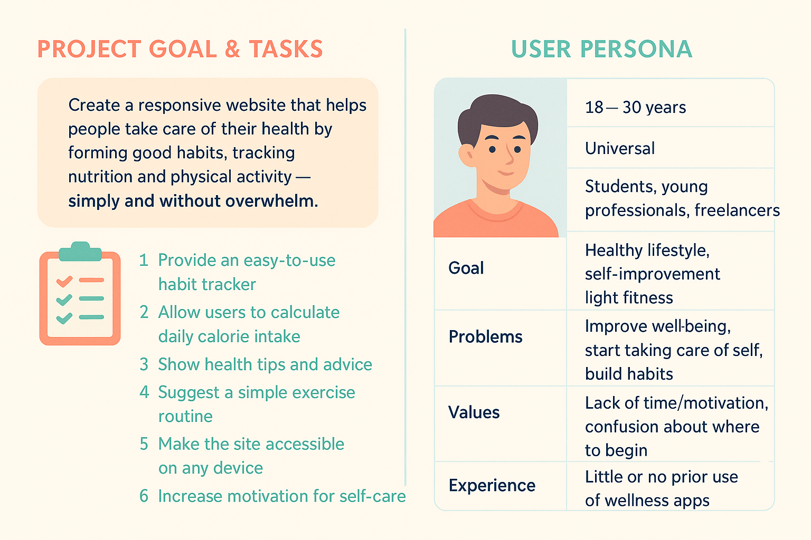

# Healthmate
Это сайт о здоровом образе жизни с личным кабинетом, трекерами привычек (воды, сна, активности), КБЖУ-калькулятором, подборкой упражнений, советами по питанию, аналитикой прогресса, блогом и возможностью общения в комьюнити.

### 🎯 Цель проекта
Создать адаптивный сайт, помогающий людям заботиться о своём здоровье, формировать полезные привычки, следить за питанием и уровнем физической активности — просто, понятно и без перегруза.

### ✅ Задачи сайта
-  Предоставить удобный трекер привычек — для воды, сна, активности и т.п.

- Позволить пользователю рассчитать суточную норму КБЖУ и скорректировать питание.

- Показать подборку полезных советов по здоровью — питание, образ жизни и т.п.

- Предложить простой комплекс упражнений — с фильтрацией по уровню и типу.

- Сделать сайт доступным с любого устройства — благодаря адаптивному дизайну.

- Повысить мотивацию пользователя к регулярной заботе о себе.

# MVP1

### 👩‍🎨 Василова Лилия (арт-директор):
- Макет сайта в Figma (desktop + mobile)

- UI-kit: цвета, шрифты, кнопки, карточки

- Пользовательские сценарии: как пользователь взаимодействует с каждым разделом

### 🧱 Мухамедьянова Ляйсан (разработчик):
- HTML и CSS верстка по макету

- Настройка адаптивности через media-запросы

- Верстка стриниц: главн, трекеры и калькулятор

### 🧩 Ахмадуллина Эмилия (разработчик):
- JavaScript — интерактив

- Реализация трекера привычек (с localStorage)

- Калькулятор КБЖУ

- Делает формы, фильтрации, модалки

### 🔄 Назирова Камила (проджект-менеджер, разработчик):
- Составление портрета аудитории, анализ конкурентов, пользовательские сценарии

- UX-копирайтинг 

- Загрузка советов/рецептов из JSON или API

- Обрабатка ошибок

# Ссылки
- [Figma](https://www.figma.com/design/I5FE14ZfvNJ9P4GwwqdOU6/Untitled?node-id=0-1&p=f&t=SmCggU4S1vtL9fLE-0)